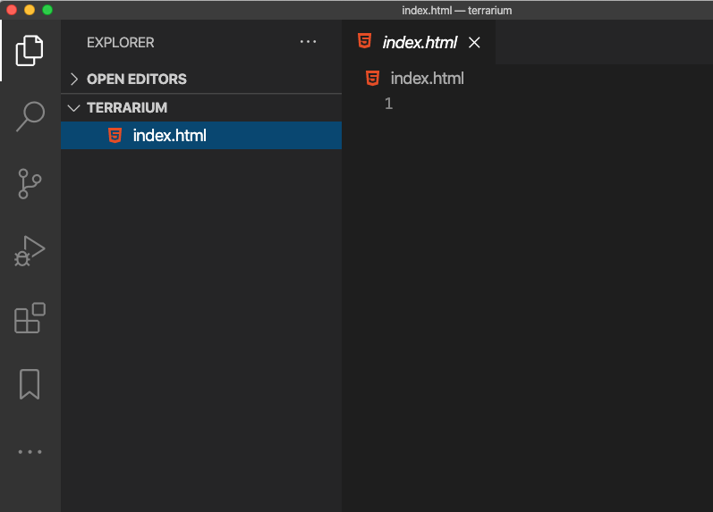

# テラリウムプロジェクト その1: HTML 入門


> Sketchnote by [Tomomi Imura](https://twitter.com/girlie_mac)

## レッスン前の小テスト

[レッスン前の小テスト](https://nice-beach-0fe9e9d0f.azurestaticapps.net/quiz/15?loc=ja)

### イントロダクション

HTML (HyperText Markup Language) は、Web の「骨格」です。CSS が HTML を「ドレスアップ」し、JavaScript が HTML に命を吹き込むとすれば、HTML は Web アプリケーションの本体となります。HTML の構文は、「head」、「body」、「footer」タグを含むため、この考えを反映しています。

このレッスンでは、HTML を使ってバーチャルテラリウムのインターフェースの「骨格」をレイアウトします。タイトルと3つのカラムがあります。右と左のカラムにはドラッグ可能な植物を配置し、中央のエリアには実際のガラス張りのテラリウムを配置します。このレッスンが終わる頃には、列の中に植物が見えるようになると思いますが、インターフェースが少し変な感じになっているかもしれません。

### タスク

コンピュータ上に 'terrarium' というフォルダを作成し、その中に 'index.html' というファイルを作成します。テラリウムのフォルダを作成した後、Visual Studio Code で新しい VS Code ウィンドウを開き、「フォルダを開く」をクリックして新しいフォルダに移動することで、この作業を行うことができます。エクスプローラペインの「ファイル」ボタンをクリックして、新しいファイルを作成してください。



もしくは

git bash 上でこれらのコマンドを使用します。
* `mkdir terrarium`
* `cd terrarium`
* `touch index.html`
* `code index.html` または `nano index.html`

> index.html ファイルはブラウザに対して、それがフォルダ内のデフォルトファイルであることを示します。`https://anysite.com/test` のような URL は、`test` というフォルダを含むフォルダ構造を用いて構築され、その中に `index.html` が含まれているかもしれません。

---

## DocType と html タグ

HTML ファイルの最初の行は、その doctype です。ファイルの一番上にこの行が必要なのは少し意外ですが、これはブラウザが現在の HTML 仕様に従った標準モードでページをレンダリングする必要があることを古いブラウザに伝えています。

> ヒント: VS Code では、タグの上にカーソルを置くと MDN リファレンスガイドからタグの使用に関する情報を得ることができます。

2行目は `<html>` タグのオープニングタグであり、それに続くのがクロージングタグ `</html>` です。これらのタグはインターフェイスのルート要素です。

### タスク

これらの行を `index.html` ファイルの先頭に追加します。

```HTML
<!DOCTYPE html>
<html></html>
```

✅ DocType をクエリ文字列で設定することで決定できるモードがいくつかあります。[Quirks モードと Standards モード](https://developer.mozilla.org/ja/docs/Web/HTML/Quirks_Mode_and_Standards_Mode)です。これらのモードは、現在では通常使用されていない本当に古いブラウザ (Netscape Navigator 4 と Internet Explorer 5) をサポートしていました。標準の doctype 宣言に固執することができます。

---

## ドキュメントの 'head'

HTML ドキュメントの 'head' 領域には、Web ページに関する重要な情報が含まれており、[メタデータ](https://developer.mozilla.org/ja/docs/Web/HTML/Element/meta)としても知られています。私たちの場合、このページがレンダリングされるために送信される Web サーバーに、以下の4つのことを伝えます。

-   ページタイトル
-   次を含むページのメタデータ:
    -   'character set' で、ページで使われている文字エンコーディングを表します
    -   IE=edge ブラウザがサポートされていることを示す `x-ua-compatible` などのブラウザ情報
    -   viewport が読み込まれたときにどのように振る舞うかについての情報を提供します。viewport の初期スケールを 1 に設定すると、ページが最初に読み込まれたときのズームレベルを制御します

### タスク

ドキュメントに 'head' ブロックを `<html>` の開始タグと終了タグの間に追加します。

```html
<head>
	<title>Welcome to my Virtual Terrarium</title>
	<meta charset="utf-8" />
	<meta http-equiv="X-UA-Compatible" content="IE=edge" />
	<meta name="viewport" content="width=device-width, initial-scale=1" />
</head>
```

✅ このように viewport の meta タグを設定するとどうなるでしょうか: `<meta name="viewport" content="width=600">`? [viewport](https://developer.mozilla.org/docs/Mozilla/Mobile/Viewport_meta_tag) についてはこちらをご覧ください。

---

## ドキュメントの `body`

### HTML タグ

HTML では、.html ファイルにタグを追加して Web ページの要素を作成します。それぞれのタグには通常、次のような開閉タグがあります。段落を示す `<p>hello</p>` のように。`<html>` タグペアの中に `<body>` タグのセットを追加して、インターフェイスのボディを作成します。

### タスク

```html
<!DOCTYPE html>
<html>
	<head>
		<title>Welcome to my Virtual Terrarium</title>
		<meta charset="utf-8" />
		<meta http-equiv="X-UA-Compatible" content="IE=edge" />
		<meta name="viewport" content="width=device-width, initial-scale=1" />
	</head>
	<body></body>
</html>
```

これで、ページの構築を始めることができます。通常は `<div>` タグを使ってページ内の個別の要素を作成します。ここでは画像を含む一連の `<div>` 要素を作成します。

### 画像

閉じタグを必要としない html タグの一つに `` タグがあります。なぜなら、ページがアイテムをレンダリングするために必要なすべての情報を含む `src` 要素を持っているからです。

アプリ内に `images` というフォルダを作成し、その中に[ソースコードフォルダ](../solution/images)内のすべての画像を追加します (植物の画像が14枚あります)。

### タスク

これらの植物の画像を `<body></body>` タグの間の2つのカラムに追加します。

```html
<div id="page">
	<div id="left-container" class="container">
		<div class="plant-holder">
			
		</div>
		<div class="plant-holder">
			
		</div>
		<div class="plant-holder">
			
		</div>
		<div class="plant-holder">
			
		</div>
		<div class="plant-holder">
			
		</div>
		<div class="plant-holder">
			
		</div>
		<div class="plant-holder">
			
		</div>
	</div>
	<div id="right-container" class="container">
		<div class="plant-holder">
			
		</div>
		<div class="plant-holder">
			
		</div>
		<div class="plant-holder">
			
		</div>
		<div class="plant-holder">
			
		</div>
		<div class="plant-holder">
			
		</div>
		<div class="plant-holder">
			
		</div>
		<div class="plant-holder">
			
		</div>
	</div>
</div>
```

> 注: Span と Div。Div は「ブロック」要素とみなされ、Span は「インライン」要素とみなされます。これらの Div を Spans に変換するとどうなるでしょうか。

このマークアップで、植物が画面に表示されるようになりました。まだ CSS を使ったスタイリングがされていないので、かなり見栄えが悪いのですが、これは次のレッスンで行います。

それぞれの画像には、画像が見えなくてもレンダリングできなくても表示される alt テキストがあります。これはアクセシビリティのために重要な属性です。アクセシビリティについては、今後のレッスンで詳しく説明します。今のところ、alt 属性は、何らかの理由でユーザーが画像を見ることができない場合 (接続速度が遅い、src 属性のエラー、ユーザーがスクリーンリーダーを使用している場合) に、画像の代替情報を提供することを覚えておいてください。

✅ それぞれの画像に同じ alt タグが付いていることに気付きましたか？これは良い習慣ですか？なぜですか、それともなぜですか? このコードを改善できますか?

---

## セマンティックマークアップ

一般的に、HTML を書くときには、意味のある「セマンティックス」を使うことが望ましいとされています。これはどういう意味でしょうか? それは、HTML タグを使用して、データやインタラクションの種類を表すために設計されていることを意味します。例えば、ページのメインタイトルテキストには `<h1>` タグを使うべきです。

`<body>` の開始タグのすぐ下に次の行を追加します。

```html
<h1>My Terrarium</h1>
```

ヘッダーを `<h1>` としたり、順序のないリストを `<ul>` とするなど、セマンティックマークアップを使用することで、スクリーンリーダーがページをナビゲートするのに役立ちます。一般的に、ボタンは `<button>` と書き、リストは `<li>` と書くべきです。特別なスタイルの `<span>` 要素とクリックハンドラを使ってボタンを模擬することは可能ですが、障害のあるユーザにとっては、ボタンがページ上のどこにあるかを判断し、要素がボタンとして表示されている場合にそれと対話するための技術を使った方が良いでしょう。このため、できるだけセマンティックマークアップを使うようにしてください。

✅ スクリーンリーダーと[それがどのようにウェブページと相互作用するか](https://www.youtube.com/watch?v=OUDV1gqs9GA)を見てみましょう。意味のないマークアップがあると、なぜユーザーをイライラさせてしまうのかわかりますか?

## テラリウム

このインターフェイスの最後の部分では、テラリウムを作成するためのマークアップを作成します。

### タスク

このマークアップを最後の `</div>` タグの上に追加します。

```html
<div id="terrarium">
	<div class="jar-top"></div>
	<div class="jar-walls">
		<div class="jar-glossy-long"></div>
		<div class="jar-glossy-short"></div>
	</div>
	<div class="dirt"></div>
	<div class="jar-bottom"></div>
</div>
```

✅ このマークアップを画面に追加したにもかかわらず、何も表示されません。なぜでしょうか?

---

## チャレンジ

HTMLに はまだ遊んで楽しいワイルドな「古い」タグがいくつかありますが、[これらのタグ](https://developer.mozilla.org/ja/docs/Web/HTML/Element#Obsolete_and_deprecated_elements)のような非推奨のタグをマークアップに使うべきではありません。それでも、古い `<marquee>` タグを使って h1 タイトルを水平方向にスクロールさせることはできますか？(もしそうする場合は、後から削除することを忘れないでください)

## レッスン後の小テスト

[レッスン後の小テスト](https://nice-beach-0fe9e9d0f.azurestaticapps.net/quiz/16?loc=ja)

## 復習と自己学習

HTML は、今日のウェブを構築するのに役立ってきた「試行錯誤された」ビルディングブロックシステムです。古いタグと新しいタグを研究することで、その歴史について少し学びましょう。あるタグが非推奨になり、あるタグが追加された理由がわかりますか？将来的にはどのようなタグが導入されるかもしれませんか？

Web やモバイル向けのサイト構築については、[Microsoft Learn](https://docs.microsoft.com/learn/modules/build-simple-website/?WT.mc_id=academic-13441-cxa) で詳しく解説しています。


## 課題

[HTML の練習: ブログのモックアップを構築する](assignment.ja.md)
