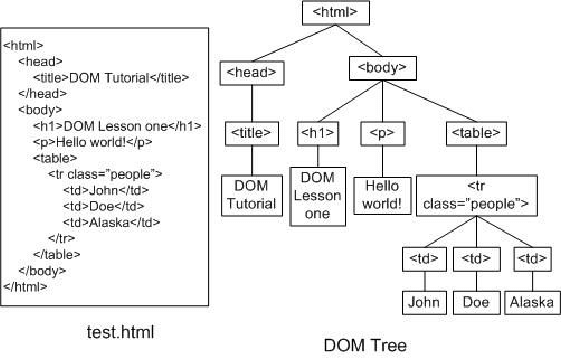

# テラリウムプロジェクト その3: DOM の操作とクロージャ


> Sketchnote by [Tomomi Imura](https://twitter.com/girlie_mac)

## レッスン前の小テスト

[レッスン前の小テスト](https://wonderful-flower-063e19f0f.1.azurestaticapps.net/quiz/19?loc=ja)

### イントロダクション

DOM (Document Object Model) を操作することは、Web  開発の重要な要素です。[MDN](https://developer.mozilla.org/ja/docs/Web/API/Document_Object_Model/Introduction) によると、"Document Object Model (DOM) は、Web 上のドキュメントの構造とコンテンツを構成するオブジェクトのデータ表現である" とのことです。Web 上での DOM 操作の難しさから、バニラ JavaScript ではなく、JavaScript のフレームワークを使って DOM を管理することが多くなっていますが、ここでは自分たちで管理していきましょう!

また、このレッスンでは、[JavaScript クロージャ](https://developer.mozilla.org/ja/docs/Web/JavaScript/Closures)という考え方を紹介します。これは、関数を別の関数で囲んで、内側の関数が外側の関数のスコープにアクセスできるようにしたものと考えてください。

> JavaScript のクロージャは広大で複雑なトピックです。このレッスンでは、このテラリウムのコードの中にクロージャがある、すなわち内側の関数と外側の関数は、内側の関数が外側の関数のスコープにアクセスできるように構築されているという最も基本的な考え方に触れます。これがどのように動作するかについての詳細な情報は [詳細なドキュメント](https://developer.mozilla.org/ja/docs/Web/JavaScript/Closures) を参照してください。

クロージャを使って DOM を操作します。

DOM をツリーと考え、Web ページのドキュメントを操作できるすべての方法を表しています。様々な API (Application Program Interfaces) が書かれており、プログラマーが自分の好きなプログラミング言語を使って DOM にアクセスし、編集、変更、再配置、その他の管理ができるようになっています。



> DOM とそれを参照する HTML マークアップの表現。[Olfa Nasraoui](https://www.researchgate.net/publication/221417012_Profile-Based_Focused_Crawler_for_Social_Media-Sharing_Websites) より

このレッスンでは、ユーザーがページ上の植物を操作できるようにする JavaScript を作成して、インタラクティブなテラリウムプロジェクトを完成させます。

### 前提条件

テラリウムの HTML と CSS が完成しているはずです。このレッスンが終わる頃には、植物をドラッグしてテラリウムの中に入れたり出したりできるようになります。

### タスク

terrarium フォルダ内に `script.js` というファイルを作成します。このファイルを `<head>` セクションにインポートします。

```html
<script src="./script.js" defer></script>
```

> 注: HTML ファイルが完全に読み込まれた後にのみ JavaScript を実行できるようにするために、外部の JavaScript ファイルを HTML ファイルにインポートする際には `defer` を使用してください。また、`async` 属性を使用することもできます。これは HTML ファイルのパース中にスクリプトを実行できるようにしますが、私たちの場合は、ドラッグスクリプトを実行する前に HTML 要素を完全に利用できるようにしておくことが重要です。
---

## DOM 要素

まず最初に必要なのは、DOM で操作したい要素への参照を作成することです。私たちの場合、それらは現在サイドバーで待機している14個の植物です。

### タスク

```javascript
dragElement(document.getElementById('plant1'));
dragElement(document.getElementById('plant2'));
dragElement(document.getElementById('plant3'));
dragElement(document.getElementById('plant4'));
dragElement(document.getElementById('plant5'));
dragElement(document.getElementById('plant6'));
dragElement(document.getElementById('plant7'));
dragElement(document.getElementById('plant8'));
dragElement(document.getElementById('plant9'));
dragElement(document.getElementById('plant10'));
dragElement(document.getElementById('plant11'));
dragElement(document.getElementById('plant12'));
dragElement(document.getElementById('plant13'));
dragElement(document.getElementById('plant14'));
```

何が起こっているのでしょうか? ドキュメントを参照し、特定の ID を持つ要素を見つけるために DOM を調べています。HTML の最初のレッスンで、各植物画像に個別の ID (`id="plant1"`) を与えたことを覚えていますか? 今度はその努力を利用してみましょう。各要素を識別した後、その項目を `dragElement` という関数に渡します。これで、HTML 内の要素がドラッグ可能になりました。

✅ なぜ Id で要素を参照するのか? なぜ CSS クラスではなく Id で要素を参照するのでしょうか? この質問に答えるには、前回の CSS のレッスンを参照してください。

---

## クロージャ

これで、内部の関数や関数 (ここでは3つの関数) を囲む外部関数である dragElement クロージャを作成する準備が整いました。

クロージャは、1つ以上の関数が外部関数のスコープにアクセスする必要がある場合に便利です。以下に例を示します。

```javascript
function displayCandy(){
	let candy = ['jellybeans'];
	function addCandy(candyType) {
		candy.push(candyType)
	}
	addCandy('gumdrops');
}
displayCandy();
console.log(candy)
```

この例では、displayCandy 関数は、新しい candy 型を関数内に既に存在する配列にプッシュする関数を囲んでいます。このコードを実行した場合、`candy` 配列はローカル変数 (クロージャのローカル) であるため、未定義になってしまいます。

✅ 配列 `candy` にアクセスできるようにするにはどうすればよいでしょうか? クロージャの外に移動させてみてください。こうすることで、配列がグローバルになり、クロージャのローカルスコープでのみ利用できるようになります。

### タスク

`script.js` の要素宣言の下に、関数を作成します。

```javascript
function dragElement(terrariumElement) {
	//スクリーン上の位置のための 4 つの位置を置きます
	let pos1 = 0,
		pos2 = 0,
		pos3 = 0,
		pos4 = 0;
	terrariumElement.onpointerdown = pointerDrag;
}
```

`dragElement` はスクリプトの先頭にある宣言から `terrariumElement` オブジェクトを取得します。そして、関数に渡されたオブジェクトのローカル位置を `0` に設定します。これらは、クロージャ内で各要素にドラッグ＆ドロップ機能を追加する際に、各要素に対して操作されるローカル変数です。テラリウムにはこれらの要素がドラッグされて配置されるので、アプリケーションはこれらの要素がどこに配置されたかを把握しておく必要があります。

さらに、この関数に渡された terrariumElement には `pointerdown` イベントが割り当てられており、これは DOM の管理を支援するために設計された [Web API](https://developer.mozilla.org/ja/docs/Web/API) の一部です。`onpointerdown` は、ボタンが押されたとき、あるいはドラッグ可能な要素がタッチされたときに発生します。このイベントハンドラは、いくつかの例外を除いて、[Web ブラウザとモバイルブラウザ](https://caniuse.com/?search=onpointerdown)の両方で動作します。

✅ [イベントハンドラの `onclick`](https://developer.mozilla.org/ja/docs/Web/API/GlobalEventHandlers/onclick) はクロスブラウザに対応しています。ここで使用する理由は何でしょうか? ここで作成しようとしているスクリーンインタラクションの正確なタイプを考えてみてください。

---

## Pointerdrag 関数

テラリウム要素をドラッグする準備ができました。イベント `onpointerdown` が発生すると、関数 pointerDrag が呼び出されます。この行のすぐ下にこの関数を追加します: `terrariumElement.onpointerdown = pointerDrag;`

### Task 

```javascript
function pointerDrag(e) {
	e.preventDefault();
	console.log(e);
	pos3 = e.clientX;
	pos4 = e.clientY;
}
```

いくつかのことが起こります。まず、`e.preventDefault();` を使用してポインタダウン時に通常発生するデフォルトのイベントが発生しないようにします。このようにして、インターフェイスの動作をより制御することができます。

> スクリプトファイルを完全にビルドした後、この行に戻って `e.preventDefault()` を使わずに試してみてください - どうなりますか？

次に、ブラウザのウィンドウで `index.html` を開き、インターフェイスを調べる。植物をクリックすると、'e' イベントがどのように捕捉されているかを確認することができます。イベントを掘り下げて、1つのポインタダウンイベントでどれだけの情報が集まっているかを確認してみましょう!

次に、ローカル変数 `pos3` と `pos4` が e.clientX に設定されていることに注目してください。`e` の値はインスペクションペインで見つけることができます。これらの値は、植物をクリックしたり触ったりした瞬間の x と y の座標を取得します。植物をクリックしたりドラッグしたりしたときの動作を細かく制御する必要があるので、その座標を把握しておく必要があります。

✅ なぜこのアプリ全体が1つの大きなクロージャで構築されているのかがより明確になってきていますか? そうでないとしたら、どのようにして14個のドラッグ可能な植物のそれぞれのスコープを維持するのでしょうか?

`pos4 = e.clientY` の下にポインタイベントの操作を2つ追加して、初期関数を完成させます。

```javascript
document.onpointermove = elementDrag;
document.onpointerup = stopElementDrag;
```
これで、植物を移動させる際にポインタに沿って植物をドラッグし、植物の選択を解除したときにドラッグジェスチャを停止させたいことを示していることになります。`onpointermove` と `onpointerup` はすべて `onpointerdown` と同じ API の一部である。まだ `elementDrag` と `stopElementDrag` 関数が定義されていないので、インターフェイスはエラーをスローします。

## elementDrag 関数と stopElementDrag 関数

植物をドラッグしてドラッグを停止したときに何が起こるかを処理する内部関数をさらに 2 つ追加して、クロージャを完成させます。あなたが望む動作は、任意の植物をいつでもドラッグして、画面上のどこにでも配置できるようにすることです。このインターフェイスは、植物を追加、削除、再配置することで、あなたが好きなように正確にあなたのテラリウムをデザインできるようにするために、かなり非オピニオン的です (例えば、ドロップゾーンはありません)。

### タスク

関数 `elementDrag` を `pointerDrag` の閉じ括弧の直後に追加する。

```javascript
function elementDrag(e) {
	pos1 = pos3 - e.clientX;
	pos2 = pos4 - e.clientY;
	pos3 = e.clientX;
	pos4 = e.clientY;
	console.log(pos1, pos2, pos3, pos4);
	terrariumElement.style.top = terrariumElement.offsetTop - pos2 + 'px';
	terrariumElement.style.left = terrariumElement.offsetLeft - pos1 + 'px';
}
```
この関数では、外部関数でローカル変数として設定した初期位置1～4の編集を多く行います。ここで何が起こっているのでしょうか?

ドラッグしながら `pos1` を `pos3` (先ほど `e.clientX` と設定したもの) から現在の `e.clientX` の値を引いた値に等しくすることで再指定します。同様の操作を `pos2` に行います。次に、`pos3` と `pos4` を要素の新しい X 座標と Y 座標にリセットします。これらの変更は、ドラッグしながらコンソールで見ることができます。次に、植物の css スタイルを操作して `pos1` と `pos2` の新しい位置をもとに植物の新しい位置を設定し、植物のオフセットと新しい位置を比較して植物の上下左右の X 座標を計算します。

> `offsetTop` と `offsetLeft` は CSS のプロパティで、要素の位置を親の位置に基づいて設定します。親は `static` として配置されていない要素であれば何でも構いません。

このように位置を再計算することで、テラリウムとその植物の挙動を微調整することができます。

### タスク 

インターフェースを完成させるための最後のタスクは、`elementDrag` の中括弧を閉じた後に `stopElementDrag` 関数を追加することです。

```javascript
function stopElementDrag() {
	document.onpointerup = null;
	document.onpointermove = null;
}
```

この小さな関数は `onpointerup` と `onpointermove` イベントをリセットし、植物のドラッグを再開して植物の進行を再開するか、新しい植物のドラッグを開始するようにします。

✅ これらのイベントを null に設定しないとどうなるのでしょうか?

これでプロジェクトが完成しました!

🥇おめでとうございます。素敵なテラリウムが完成しましたね。 

---

## チャレンジ

新しいイベントハンドラをクロージャに追加して、植物にもっと何かをするようにします。例えば、植物をダブルクリックして前の方に持ってきます。創造力を発揮してください。

## レッスン後の小テスト

[レッスン後の小テスト](https://wonderful-flower-063e19f0f.1.azurestaticapps.net/quiz/20?loc=ja)

## 復習と自己学習

画面の周りに要素をドラッグすることは些細なことのように思えますが、これには多くの方法があり、求める効果に応じて多くの落とし穴があります。実際、試してみることができる[ドラッグ＆ドロップ API](https://developer.mozilla.org/ja/docs/Web/API/HTML_Drag_and_Drop_API) があります。このモジュールでは使用しませんでしたが、自分のプロジェクトでこの API を試してみて、何ができるか見てみてください。

ポインタイベントの詳細は [W3C docs](https://www.w3.org/TR/pointerevents1/) や [MDN web docs](https://developer.mozilla.org/ja/docs/Web/API/Pointer_events) を参照してください。

常に [CanIUse.com](https://caniuse.com/) でブラウザの機能を確認してください。

## 課題

[DOM をもう少し使いこなす](assignment.ja.md)

