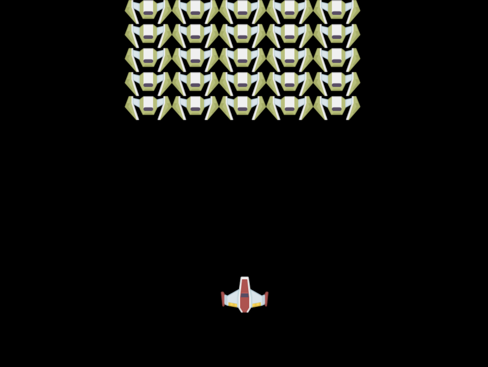

# Space 게임 제작하기 파트 2: Canvas에 영웅과 몬스터 그리기

## 강의 전 퀴즈

[Pre-lecture quiz](../.github/pre-lecture-quiz.md)

## Canvas

canvas는 내용이 없는 게 기본인 HTML 요소입니다; 빈 상태입니다. 그리는 작업으로 추가해야 합니다.

✅ MDN애서 [Canvas API에 대하여 더](https://developer.mozilla.org/en-US/docs/Web/API/Canvas_API) 읽어보세요.

보통 페이지 본문의 일부로 선언되는 방법은 다음과 같습니다:

```html
<canvas id="myCanvas" width="200" height="100"></canvas>
```

위에서 우리는 `id`, `width`와 `height`를 설정합니다.

- `id`: 상호 작용을 해야 할 순간에 참조할 수 있도록 지정하세요.
- `width`: 요소의 너비입니다.
- `height`: 요소의 높이입니다.

## 간단한 geometry 그리기

캔버스는 데카르트 좌표계로 사물을 그립니다. 따라서 x-축과 y-축을 이용하여 무언가의 위치를 나타냅니다. 위치 `0,0`은 죄측 상단이며 우측 하단은 캔버스의 너비와 높이라고 말한 위치입니다.


> Image from [MDN](https://developer.mozilla.org/en-US/docs/Web/API/Canvas_API/Tutorial/Drawing_shapes)

캔버스 요소에 그리려면 다음 단계를 거쳐야 합니다:

1. 캔버스 요소에 **참조를 가져옵니다**.
1. 캔버스 요소에 있는 Context 요소로 **참조를 가져옵니다**.
1. 컨텍스트 요소를 사용하여 **그리는 작업을 수행**합니다.

위 단계의 코드는 일반적으로 다음과 같습니다:

```javascript
// draws a red rectangle
//1. get the canvas reference
canvas = document.getElementById("myCanvas");

//2. set the context to 2D to draw basic shapes
ctx = canvas.getContext("2d");

//3. fill it with the color red
ctx.fillStyle = 'red';

//4. and draw a rectangle with these parameters, setting location and size
ctx.fillRect(0,0, 200, 200) // x,y,width, height
```

✅ Canvas API는 2D 모양에 가장 초점이 맞추어져 있습니다, 그러나 웹사이트에서 3D 요소를 그려야 된다면, [WebGL API](https://developer.mozilla.org/en-US/docs/Web/API/WebGL_API)를 사용해야 할 수도 있습니다.

Canvas API를 사용하면 다음과 같은 모든 종류를 그릴 수 있습니다:

- **기하학 모양**, 직사각형을 그리는 방법은 이미 보여 주었지만, 더 많이 그릴 수 있습니다.
- **텍스트**, 원하는 폰트와 색상으로 텍스트를 그릴 수 있습니다.
- **이미지**, 예를 들면 .jpg 혹은 .png와 같은 이미지 어셋을 바탕으로 이미지를 그릴 수 있습니다.

✅ 시도 해보세요! 직사각형을 어떻게 그리는지 알고 있으면, 패이지에 원을 그릴 수 있나요? CodePen에서 흥미로운 캔버스 그림을 보세요. 여기 [particularly impressive example](https://codepen.io/dissimulate/pen/KrAwx)이 있습니다.

## 이미지 어셋 불러오고 그리기

`Image` 객체를 만들고 `src` 속성을 설정하여 이미지 어셋을 불러옵니다. 그런 다음 `load` 이벤트를 수신하여 사용할 준비가 되었는지 알 수 있습니다. 코드는 다음과 같습니다:

### 어셋 불러오기

```javascript
const img = new Image();
img.src = 'path/to/my/image.png';
img.onload = () => {
  // image loaded and ready to be used
}
```

### Load asset 패턴

위의 내용을 이 구조로 래핑하는 것이 좋습니다, 그래서 쓰기 더 쉽고 완전히 불러올 수 있을 때만 조작하려고 시도합니다:

```javascript
async function loadAsset(path) {
  return new Promise((resolve) => {
    const img = new Image();
    img.src = path;
    img.onload = () => {
      // image loaded and ready to be used
    }
    resolve(img);
  })
}

// use like so

async function run() {
  const heroImg = await loadAsset('hero.png')
  const monsterImg = await loadAsset('monster.png')
}

```

게임 어셋을 화면에 그리려면, 코드는 다음과 같습니다:

```javascript
async function run() {
  const heroImg = await loadAsset('hero.png')
  const monsterImg = await loadAsset('monster.png')

  canvas = document.getElementById("myCanvas");
  ctx = canvas.getContext("2d");
  ctx.drawImage(heroImg, canvas.width/2,canvas.height/2);
  ctx.drawImage(monsterImg, 0,0);
}
```

## 이제 게임 제작을 시작할 시간입니다

### 무엇을 만드나요

Canvas 요소가 있는 웹 페이지를 만듭니다. 검은 화면 `1024 * 768`을 렌더링해야 합니다. 두 가지 이미지를 제공받았습니다:

- Hero ship

   

- 5*5 monster

   

### 개발 시작하기 위한 권장 단계

`your-work` 하위 폴더에서 생성된 파일을 찾습니다. 다음을 포함해야 합니다:

```bash
-| assets
  -| enemyShip.png
  -| player.png
-| index.html
-| app.js
-| package.json
```

Visual Studio Code에서 폴더의 복사본을 엽니다. 로컬 개발 환경을 설정해야 합니다, NPM과  Node가 설치되어있는 Visual Studio Code를 사용하는 것이 좋습니다. 컴퓨터에 `npm`이 설정되어 있지 않은 경우에, [방법은 다음과 같습니다](https://www.npmjs.com/get-npm).

`your_work` 폴더로 이동하여 프로젝트를 시작합니다:

```bash
cd your-work
npm start
```

위 코드는 `http://localhost:5000` 주소에서 HTTP 서버를 시작합니다. 브라우저를 열고 해당 주소를 입력하세요. 지금은 비어있는 페이지지만, 곧 바뀔 것 입니다

> Note: 화면에서 변경점을 보고싶다면, 브라우저를 새로 고치세요.

### 코드 추가하기

필요한 코드를 `your-work/app.js`에 추가하여 아래 문제를 해결합니다

1. 검은 바탕으로 canvas **그리기**
   > tip: `/app.js`의 TODO 아래에 적절히 두 줄을 추가하며, `ctx` 요소를 검은 색으로 설정하고 상단/좌측 좌표를 0,0으로 설정하고 높이와 너비를 캔버스와 동일하게 설정합니다.
2. 텍스쳐 **불러오기**
   > tip: `await loadTexture`를 사용하여 플레이어와 적 이미지를 추가하고 이미지 경로를 전달합니다. 아직 화면에서 볼 수 없습니다!
3. 화면 중앙 하단의 중간에 영웅 **그리기**
   > tip: `drawImage` API 를 사용하여 화면에 heroImg를 그립니다, `canvas.width / 2 - 45`와 `canvas.height - canvas.height / 4)`로 설정합니다.
4. 5*5 몬스터를 **그리기**
   > tip: 이제 주석을 풀고 화면에 적을 그립니다. 그런 다음, `createEnemies` 함수로 가서 작성합니다.

   먼저, 약간의 constants를 설정합니다:

    ```javascript
    const MONSTER_TOTAL = 5;
    const MONSTER_WIDTH = MONSTER_TOTAL * 98;
    const START_X = (canvas.width - MONSTER_WIDTH) / 2;
    const STOP_X = START_X + MONSTER_WIDTH;
    ```

    그런 다음, 화면에 몬스터 배열을 그리는 반복문을 만듭니다:

    ```javascript
    for (let x = START_X; x < STOP_X; x += 98) {
        for (let y = 0; y < 50 * 5; y += 50) {
          ctx.drawImage(enemyImg, x, y);
        }
      }
    ```

## 결과

완성된 결과는 아래와 같이 보이게 됩니다:



## 솔루션

먼저 직접 해결해보고 문제가 발생한다면, [solution](../solution/app.js)을 보세요

---

## 🚀 도전

2D-중심의 Canvas API로 그리는 방식에 대해 배웠습니다; [WebGL API](https://developer.mozilla.org/en-US/docs/Web/API/WebGL_API)를 살펴보고, 3D 개체를 그려보세요.

## 강의 후 퀴즈

[Post-lecture quiz](../.github/post-lecture-quiz.md)

## 리뷰 & 자기주도 학습

[reading about it](https://developer.mozilla.org/en-US/docs/Web/API/Canvas_API)을 통해 Canvas API에 대해 자세히 알아보세요.

## 과제

[Play with the Canvas API](../assignment.md)