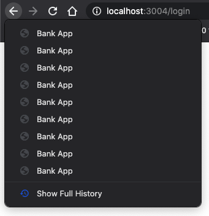

# 建立銀行網頁應用程式 Part 1：HTML 模板與網頁路由

## 課前測驗

[課前測驗](https://calm-wave-0d1a32b03.1.azurestaticapps.net/quiz/41?loc=zh_tw)

### 大綱

自從 JavaScript 出現在瀏覽器後，網頁開始變得更複雜、更多互動。網頁技術已經普遍地用於建立功能齊全的應用程式，執行在瀏覽器上，我們稱之為[網頁應用程式](https://zh.wikipedia.org/zh-tw/%E7%BD%91%E7%BB%9C%E5%BA%94%E7%94%A8%E7%A8%8B%E5%BA%8F)。基於網頁應用程式的高互動性，使用者不會想在互動後做所有頁面載入所需的等待。這也是為什麼 JavaScript 使用 DOM 來更新 HTML，提供使用者更流暢的網頁體驗。

在這堂課程中，我們會譜出銀行網頁應用程式的基礎，使用 HTML 模板建立不同的畫面，各自顯示並更新內容，而不必每次都需要載入整個 HTML 頁面。

### 開始之前

你需要一個網頁伺服器來測試我們要建的專案。如果你還沒有，你可以安裝 [Node.js](https://nodejs.org) 並在你的專案資料夾中使用指令 `npx lite-server`。這會建立一個本地端的網頁伺服器，在瀏覽器上開啟你的網頁程式。

### 準備

在你的電腦上，建立資料夾 `bank`，並在裡面建立檔案 `index.html`。我們以這個 HTML [樣板](https://en.wikipedia.org/wiki/Boilerplate_code)來開始：

```html
<!DOCTYPE html>
<html lang="en">
  <head>
    <meta charset="UTF-8">
    <meta name="viewport" content="width=device-width, initial-scale=1.0">
    <title>Bank App</title>
  </head>
  <body>
    <!-- This is where you'll work -->
  </body>
</html>
```

---

## HTML 模板(templates)

如果你想在同一個網頁上建立不同的畫面，其中一種方法是各自建立一個 HTML 檔給每一個你想呈現的子畫面。然而，這個方式有許多不便之處：

- 你需要在切換頁面時，重新載入整個網頁。這會很花時間。
- 在不同子頁面上共享數據會是一大難題。

另一個解決方案是只有一個 HTML 檔案，並使用 `<template>` 元素定義多個 [HTML 模板](https://developer.mozilla.org/docs/Web/HTML/Element/template)。
一個模板提供可重複利用的 HTML 區塊，它不會顯示在瀏覽器上，而在需要之時由 JavaScript 以呈現出來。

### 課題

我們會建立一個銀行網頁應用程式，其中包含兩個子畫面：登入頁面與儀表板頁面。首先，我們在網頁應用程式的 HTML body 上，建立放置區來放置模板的子頁面。

```html
<div id="app">Loading...</div>
```

我們給它 `id`，以利後續 JavaScript 對它的追蹤。

> 提示：因為它裡面元素的內容會被置換，我們可以建立載入中訊息或提示，在應用程式載入時顯示出來。

接下來，我們加入下列的 HTML 模板，給登入畫面使用。現在我們只加入一行標題與一個有連結的區塊，進行簡單的功能。

```html
<template id="login">
  <h1>Bank App</h1>
  <section>
    <a href="/dashboard">Login</a>
  </section>
</template>
```

接著，加入另一個 HTML 模板給儀表板頁面。這個頁面就會包含不同的區塊：

- 包含標題與登出連結的網頁標頭
- 現在的銀行帳戶餘額
- 一個歷史交易清單的表格

```html
<template id="dashboard">
  <header>
    <h1>Bank App</h1>
    <a href="/login">Logout</a>
  </header>
  <section>
    Balance: 100$
  </section>
  <section>
    <h2>Transactions</h2>
    <table>
      <thead>
        <tr>
          <th>Date</th>
          <th>Object</th>
          <th>Amount</th>
        </tr>
      </thead>
      <tbody></tbody>
    </table>
  </section>
</template>
```

> 提示：在建立 HTML 模板時，如果你想知道它的呈現樣子為何，你可以註解掉 `<template>` 與 `</template>`。使用 `<!-- -->` 來註解它們。

✅ 你知道為什麼我們需要使用模板的 `id` 屬性嗎？我們可以使用別的屬性，例如 classes 嗎？

## 利用 JavaScript 顯示模板

現在，如果你使用瀏覽器打開你的應用程式，你會看到畫面卡在 `Loading...` 的畫面。那是因為我們需要為它新增一些 JavaScript 的程式碼來顯示出這些 HTML 模板。

展現模板通常需要三個步驟：

1. 在 DOM 內接收模板元素，舉例來說，使用 [`document.getElementById`](https://developer.mozilla.org/docs/Web/API/Document/getElementById)。
2. 複製模板元素，使用 [`cloneNode`](https://developer.mozilla.org/docs/Web/API/Node/cloneNode)。
3. 將複製元素接到 DOM 的顯示元素上，例如使用 [`appendChild`](https://developer.mozilla.org/docs/Web/API/Node/appendChild)。

✅ 我們為什麼需要在接到 DOM 前，複製一份模板？你能想像如果我們省略了此步驟後，會發生什麼事嗎？

### 課題

在資料夾中建立新檔案 `app.js`，並在你的 HTML 檔案的 `<head>` 區塊中中匯入這個新檔案：

```html
<script src="app.js" defer></script>
```

在 `app.js` 中，我們建立新函式 `updateRoute`：

```js
function updateRoute(templateId) {
  const template = document.getElementById(templateId);
  const view = template.content.cloneNode(true);
  const app = document.getElementById('app');
  app.innerHTML = '';
  app.appendChild(view);
}
```

這裡做的事情就是我們上述提及過的三個步驟。我們使用 `templateId` 展現了模板，並將複製的內容接在我們的放置區中。注意我們需要使用 `cloneNode(true)` 來複製整個模板的子樹。

現在我們呼叫這個函式，指定特定的模板並觀察結果。

```js
updateRoute('login');
```

✅ 程式碼中 `app.innerHTML = '';` 的目的為何？如果刪去它會發生什麼事？

## 建立網頁路由(Routing)

當提及網頁應用程式時，我們稱呼 *路由(Routing)* 來連接**網址(URLs)**到特定的畫面上，呈現相關內容。一個含有多個 HTML 檔的網頁，網址又象徵著檔案路徑，這能自動地完成網址與檔案的轉換。舉例來說，專案資料夾內有這些檔案：

```
mywebsite/index.html
mywebsite/login.html
mywebsite/admin/index.html
```

若我們建立網路伺服器，根目錄為 `mywebsite`，則 URL 路由為：

```
https://site.com            --> mywebsite/index.html
https://site.com/login.html --> mywebsite/login.html
https://site.com/admin/     --> mywebsite/admin/index.html
```

然而，在我們的網頁應用中，我們使用單一個 HTML 檔包含所有的子畫面到其中，所以預設的路由行為並不能幫助到本次專案。我們需要手動進行連接，使用 JavaScript 更新該被顯示出來的模板。

### 課題

我們使用簡單的物件來達成 URL 網址與模板的[關聯實體關係](https://en.wikipedia.org/wiki/Associative_array)。加入這個物件到 `app.js` 檔案的最上方。

```js
const routes = {
  '/login': { templateId: 'login' },
  '/dashboard': { templateId: 'dashboard' },
};
```

現在，我們對函式 `updateRoute` 做一些更動。我們不直接將 `templateId` 作為參數傳遞，而是接收現在的 URL 網址，在使用關聯表來取得相對應的模板 ID 數值。我們可以使用 [`window.location.pathname`](https://developer.mozilla.org/docs/Web/API/Location/pathname) 來取得網址的部分路徑。

```js
function updateRoute() {
  const path = window.location.pathname;
  const route = routes[path];

  const template = document.getElementById(route.templateId);
  const view = template.content.cloneNode(true);
  const app = document.getElementById('app');
  app.innerHTML = '';
  app.appendChild(view);
}
```

這邊我們建立了模板的路由關係。你可以藉由修改網址，來測試你的網頁是否正確的轉移。

✅ 如果你輸入了不存在的網址，它會發生什麼事？我們該如何解決呢？

## 加入網頁訪問

下一個步驟為在不更改網址的情況下，新增網頁訪問的途徑。這會做出兩件事情：

  1. 更新現在的網址
  2. 更新要被顯示的模板到新的網址中

我們已經完成了第二點，藉由使用函式 `updateRoute` 來完成，所以我們需要釐清該如何更新現在的網址。

我們需要使用 JavaScript，詳細來看為 [`history.pushState`](https://developer.mozilla.org/docs/Web/API/History/pushState)，更新網址位置並建立瀏覽紀錄，同時不更新整個 HTML 頁面。

> 筆記：網頁超連結元素 [`<a href>`](https://developer.mozilla.org/docs/Web/HTML/Element/a) 可以建立不同網址的連接，但它預設上會讓瀏覽器重新載入 HTML 檔。我們需要手動新增 JavaScript 處理路由以避免此行為發生，在點擊事件中使用函式 preventDefault() 。

### 課題

我們來建立新的函式，讓應用程式得以做網頁的訪問：

```js
function navigate(path) {
  window.history.pushState({}, path, path);
  updateRoute();
}
```

這個方法根據導入的路徑位置，更新了現在的網址位置，再更新模板上去。`window.location.origin` 回傳了網址的根路徑，允許我們重新構築完整的網址。

現在，藉由上述的函式，我們可以解決找不到網頁路徑的問題。我們修改函式 `updateRoute`，在找不到該網頁時強制轉移到一個存在的網頁。

```js
function updateRoute() {
  const path = window.location.pathname;
  const route = routes[path];

  if (!route) {
    return navigate('/login');
  }

  ...
```

如果找不到網頁路由時，我們會導往 `login` 的頁面。

現在，我們建立新的函式，在連結被點擊時取得網址位置，並避免瀏覽器進行預設上的重新載入：

```js
function onLinkClick(event) {
  event.preventDefault();
  navigate(event.target.href);
}
```

現在我們完成應用程式的網頁訪問系統，在 HTML 檔的 *Login* 與 *Logout* 連結加入此函式。

```html
<a href="/dashboard" onclick="onLinkClick(event)">Login</a>
...
<a href="/login" onclick="onLinkClick(event)">Logout</a>
```

使用 [`onclick`](https://developer.mozilla.org/docs/Web/API/GlobalEventHandlers/onclick) 屬性會將 `click` 事件連接到 JavaScript 程式碼中，這邊會再呼叫函式 `navigate()`。

試著點擊這些連結，你應該能造訪網頁中不同的的畫面了。

✅ `history.pushState` 這個方法是 HTML5 標準的一部份，支援在[所有當代的瀏覽器](https://caniuse.com/?search=pushState)上。如果你要為舊款的瀏覽器設計網頁應用程式的話，這邊有一個技巧來加在這個 API 上：在路徑前面加上 [hash (`#`)](https://en.wikipedia.org/wiki/URI_fragment)，你可以完成網頁路由與不須重載網頁的功能，它的目的就是在同一個網頁中做內部連結的切換。

## 處理瀏覽器的「上一頁」與「下一頁」

使用 `history.pushState` 會建立瀏覽器的瀏覽紀錄。你可以使用瀏覽器的*上一頁*來確認，它應該要能呈現像這樣的畫面：



點擊上一頁數次，你會看到網址會改變且歷史紀錄也更新上去了，但同一個模板還是被顯示出來。

這是因為網頁不知道該如何依據歷史紀錄來呼叫 `updateRoute()`。如果你閱讀了 [`history.pushState` 技術文件](https://developer.mozilla.org/docs/Web/API/History/pushState)，你會發現如果狀態改變 ── 同時代表著網址改變 ── [`popstate`](https://developer.mozilla.org/docs/Web/API/Window/popstate_event) 事件就會被觸發。我們會利用此特徵來修復這個問題。

### 課題

為了在瀏覽器歷史改變時更新該被顯示的模板，我們會以新函式來呼叫 `updateRoute()`。我們在 `app.js` 檔最下方加入：

```js
window.onpopstate = () => updateRoute();
updateRoute();
```

> 筆記：我們在這裡使用[箭頭函式](https://developer.mozilla.org/docs/Web/JavaScript/Reference/Functions/Arrow_functions)，簡短地宣告 `popstate` 事件處理器。它與正規的函式的功能是一樣的。

這是關於箭頭函式的回想影片：

[](https://youtube.com/watch?v=OP6eEbOj2sc "箭頭函式")

> 點擊上方圖片以觀看關於箭頭函式的影片。

現在，試著點擊瀏覽器上的上一頁與下一頁，檢查這次模板是否正確地更新出來。

---

## 🚀 挑戰

加入新的模板與對應的關聯表，顯示出本應用程式第三頁的功能 ── 帳戶餘額。

## 課後測驗

[課後測驗](https://calm-wave-0d1a32b03.1.azurestaticapps.net/quiz/42?loc=zh_tw)

## 複習與自學

網頁路由是網頁開發中很棘手的部分，特別是將網頁切換轉變為單一頁面應用程式(Single Page Application)。閱讀關於[Azure Static Web App 提供服務的方式](https://docs.microsoft.com/azure/static-web-apps/routes?WT.mc_id=academic-13441-cxa)以處理網頁路由。你能解釋為什麼文件上的某些決定會如此重要呢？

## 作業

[增進網頁路由](assignment.zh-tw.md)
