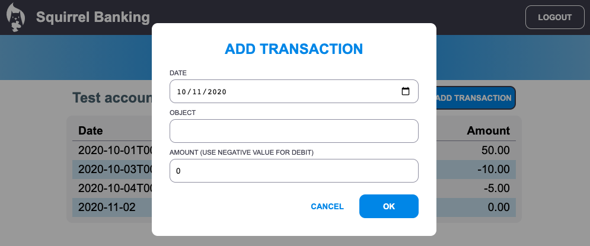

# バンキングアプリを作ろう その 4: 状態管理の概念

## レッスン前の小テスト

[レッスン前の小テスト](https://nice-beach-0fe9e9d0f.azurestaticapps.net/quiz/47?loc=ja)

### イントロダクション

Web アプリケーションが成長するにつれて、すべてのデータの流れを追跡することが難しくなります。どのコードがデータを取得し、どのページがデータを消費し、どこでいつ更新する必要があるのか...メンテナンスが難しい厄介なコードになってしまいがちです。これは、ユーザーデータなど、アプリの異なるページ間でデータを共有する必要がある場合に特に当てはまります。*状態管理*の概念は、あらゆる種類のプログラムに常に存在していますが、Web アプリの複雑さが増すにつれ、開発中に考えるべき重要なポイントになってきています。

この最後のパートでは、状態の管理方法を再考するために構築したアプリを見ていきます。任意の時点でのブラウザの更新をサポートし、ユーザーセッション間でのデータの永続化を可能にします。

### 前提条件

このレッスンでは、Web アプリの[データ取得](../../3-data/translations/README.ja.md)の部分が完了している必要があります。また、アカウントデータを管理するためには、ローカルに [Node.js](https://nodejs.org/ja) をインストールし、[サーバー API を実行する](../../api/translations/README.ja.md)をインストールする必要があります。

ターミナルでこのコマンドを実行することで、サーバーが正常に動作しているかどうかをテストすることができます。

```sh
curl http://localhost:5000/api
# -> 結果として "Bank API v1.0.0" を返す必要があります。
```

---

## 状態管理を再考する

[前回のレッスン](../../3-data/translations/README.ja.md)では、現在ログインしているユーザーの銀行データを含むグローバル変数 `account` を使って、アプリの基本的な状態の概念を紹介しました。しかし、現在の実装にはいくつかの欠陥があります。ダッシュボード上でページをリフレッシュしてみてください。何が起こるのでしょうか？

現在のコードには3つの問題があります。

- ブラウザをリフレッシュするとログインページに戻るため、状態は保持されません
- 状態を変更する関数が複数あります。アプリが大きくなると、変更を追跡するのが難しくなり、1つの更新を忘れがちになります
- 状態が片付かず、*Logout* をクリックしてもログインページになってもアカウントデータが残っています

これらの問題に一つずつ対処するためにコードを更新することもできますが、コードの重複が多くなり、アプリがより複雑になり、メンテナンスが難しくなります。あるいは、数分間小休止して、戦略を再考することもできます。

> ここで本当に解決しようとしている問題は何か?

[状態管理](https://en.wikipedia.org/wiki/State_management)は、この2つの特定の問題を解決するための良いアプローチを見つけることがすべてです。

- アプリ内のデータフローをわかりやすく保つには?
- アプリ内のデータフローを理解しやすい状態に保つには?

これらの問題を解決したら、他の問題はすでに解決されているか、簡単に解決できるようになっているかもしれません。これらの問題を解決するための多くの可能なアプローチがありますが、ここでは、**データとそれを変更する方法**を集中化することで構成される一般的な解決策を採用します。データの流れは次のようになります。


> ここでは、データが自動的にビューの更新のトリガーとなる部分は、[Reactive Programming](https://en.wikipedia.org/wiki/Reactive_programming)のより高度な概念に関連しているので、ここでは取り上げません。深く掘り下げたい方には良いフォローアップテーマになるでしょう。

✅ 状態管理へのさまざまなアプローチを持つライブラリはたくさんありますが、[Redux](https://redux.js.org) は人気のあるオプションです。大規模な Web アプリケーションで直面する可能性のある問題や、それをどのように解決できるかを学ぶための良い方法として、使用されている概念やパターンを見てみましょう。

### タスク

まずは少しリファクタリングをしてみましょう。`account` 宣言を置換します。

```js
let account = null;
```

このようにします。

```js
let state = {
  account: null
};
```

このアイデアは、単一のステートオブジェクトにすべてのアプリデータを*中央集権化することです。今のところは `account` があるだけなので、あまり変化はありませんが、進化のためのパスを作成します。

また、これを使って関数を更新しなければなりません。関数 `register()` と `login()` において、`account = ...` を `state.account = ...` に置き換えてください。

関数 `updateDashboard()` の先頭に以下の行を追加します。

```js
const account = state.account;
```

今回のリファクタリングだけではあまり改善は見られませんでしたが、次の変更のための基礎を固めようと考えたのです。

## データ変更の追跡

データを保存するために `state` オブジェクトを配置したので、次のステップは更新を一元化することです。目的は、いつ変更があったのか、いつ変更が発生したのかを簡単に把握できるようにすることです。

`state` オブジェクトに変更が加えられないようにするためには、`state` オブジェクトを [*immutable*](https://en.wikipedia.org/wiki/Immutable_object) と考えるのも良い方法です。これはまた、何かを変更したい場合には新しいステートオブジェクトを作成しなければならないことを意味します。このようにすることで、潜在的に望ましくない[副作用](https://ja.wikipedia.org/wiki/%E5%89%AF%E4%BD%9C%E7%94%A8_(%E3%83%97%E3%83%AD%E3%82%B0%E3%83%A9%E3%83%A0))についての保護を構築し、アンドゥ/リドゥの実装のようなアプリの新機能の可能性を開くと同時に、デバッグを容易にします。例えば、ステートに加えられたすべての変更をログに記録し、バグの原因を理解するために変更の履歴を保持することができます。

JavaScript では、[`Object.freeze()`](https://developer.mozilla.org/ja/docs/Web/JavaScript/Reference/Global_Objects/Object/freeze) を使って、オブジェクトの不変バージョンを作成することができます。不変オブジェクトに変更を加えようとすると例外が発生します。

✅ *浅い*不変オブジェクトと*深い*不変オブジェクトの違いを知っていますか? それについては [こちら](https://developer.mozilla.org/ja/docs/Web/JavaScript/Reference/Global_Objects/Object/freeze#What_is_shallow_freeze) を参照してください。

### タスク

新しい `updateState()` 関数を作成してみましょう。

```js
function updateState(property, newData) {
  state = Object.freeze({
    ...state,
    [property]: newData
  });
}
```

この関数では、新しいステートオブジェクトを作成し、[*spread (`...`) operator*](https://developer.mozilla.org/ja/docs/Web/JavaScript/Reference/Operators/Spread_syntax#spread_in_object_literals) を使用して前のステートからデータをコピーしています。次に、[ブラケット表記](https://developer.mozilla.org/ja/docs/Web/JavaScript/Guide/Working_with_Objects#objects_and_properties) `[property]` を使用して、ステートオブジェクトの特定のプロパティを新しいデータでオーバーライドします。最後に、`Object.freeze()`を使ってオブジェクトをロックし、変更を防ぎます。今のところ、`account` プロパティだけがステートに保存されていますが、この方法では必要なだけのプロパティをステートに追加することができます。

また、`state` の初期化を更新して初期状態も凍結されるようにします。

```js
let state = Object.freeze({
  account: null
});
```

その後、`state.account = result;` の代入を `state.account = result;` に置き換えて `register` 関数を更新します。

```js
updateState('account', result);
```

同じことを `login` 関数で行い、`state.account = data;` に置き換えます。

```js
updateState('account', data);
```

ここで、ユーザーが *Logout* をクリックしたときにアカウントデータがクリアされない問題を修正します。

新しい関数 `logout()` を作成します。

```js
function logout() {
  updateState('account', null);
  navigate('/login');
}
```

`updateDashboard()` で、リダイレクト `return navigate('/login');` を `return logout()` に置き換えてください。

新しいアカウントを登録して、ログアウトとログインを繰り返してみて、すべてが正常に動作することを確認してください。

> ヒント: `updateState()` の下部に `console.log(state)` を追加し、ブラウザの開発ツールでコンソールを開くことで、すべての状態の変化を見ることができます。

## 状態を維持する

ほとんどの Web アプリは、データを保持しておかないと正常に動作しません。すべての重要なデータは通常、データベースに保存され、サーバー API を介してアクセスされます。しかし、時には、より良いユーザーエクスペリエンスや読み込みパフォーマンスを向上させるために、ブラウザ上で実行されているクライアントアプリのデータを永続化することも興味深いことです。

ブラウザにデータを永続化する場合、いくつかの重要な質問があります。

- *データは機密性の高いものでしょうか?* ユーザーパスワードなどの機密性の高いデータをクライアントに保存することは避けるべきです
- *このデータをどのくらいの期間保存する必要がありますか?* このデータにアクセスするのは現在のセッションのためだけですか、それとも永遠に保存したいですか?

Web アプリ内の情報を保存する方法は、目的に応じて複数あります。例えば、URL を使用して検索クエリを保存し、ユーザー間で共有できるようにすることができます。また、[認証](https://en.wikipedia.org/wiki/Authentication)情報のように、データをサーバーと共有する必要がある場合は、[HTTP クッキー](https://developer.mozilla.org/ja/docs/Web/HTTP/Cookies)を使用することもできます。

もう一つの選択肢は、データを保存するための多くのブラウザ API のうちの一つを使用することです。その中でも特に興味深いものが2つあります。

- [`localStorage`](https://developer.mozilla.org/ja/docs/Web/API/Window/localStorage): [Key/Value ストア](https://en.wikipedia.org/wiki/Key%E2%80%93value_database)は、異なるセッションにまたがって現在の Web サイトに固有のデータを永続化することができます。保存されたデータは期限切れになることはありません
- [`sessionStorage`](https://developer.mozilla.org/ja/docs/Web/API/Window/sessionStorage): これは `localStorage` と同じように動作しますが、保存されたデータはセッションの終了時(ブラウザが閉じられた時)に消去されます

これらの API はどちらも[文字列](https://developer.mozilla.org/ja/docs/Web/JavaScript/Reference/Global_Objects/String)しか保存できないことに注意してください。複雑なオブジェクトを格納したい場合は、[`JSON.stringify()`](https://developer.mozilla.org/ja/docs/Web/JavaScript/Reference/Global_Objects/JSON/stringify) を使って [JSON](https://developer.mozilla.org/ja/docs/Web/JavaScript/Reference/Global_Objects/JSON) 形式にシリアライズする必要があります。

✅ サーバーで動作しない Web アプリを作成したい場合は、[`IndexedDB` API](https://developer.mozilla.org/ja/docs/Web/API/IndexedDB_API) を使用してクライアント上にデータベースを作成することも可能です。これは高度なユースケースや、かなりの量のデータを保存する必要がある場合には、使用するのがより複雑になるため、予約されています。

### タスク

ユーザーが明示的に *Logout* ボタンをクリックするまでログインしたままにしたいので、`localStorage` を使ってアカウントデータを保存します。まず、データを保存するためのキーを定義しましょう。

```js
const storageKey = 'savedAccount';
```

そして、この行を `updateState()` 関数の最後に追加します。

```js
localStorage.setItem(storageKey, JSON.stringify(state.account));
```

これで、以前はすべての状態の更新を一元化していたので、ユーザーアカウントのデータは永続化され、常に最新の状態になります。ここからが、以前のすべてのリファクタリングの恩恵を受け始めるところです 🙂。

データが保存されているので、アプリが読み込まれたときに復元することにも気を配らなければなりません。初期化コードが増えてくるので、`app.js` の下部に以前のコードも含めた `init` 関数を新たに作成しておくといいかもしれません。

```js
function init() {
  const savedAccount = localStorage.getItem(storageKey);
  if (savedAccount) {
    updateState('account', JSON.parse(savedAccount));
  }

  // 前回の初期化コード
  window.onpopstate = () => updateRoute();
  updateRoute();
}

init();
```

ここでは保存されたデータを取得し、もしあればそれに応じて状態を更新します。ページの更新中に状態に依存するコードがあるかもしれないので、ルートを更新する前にこれを行うことが重要です。

アカウントデータを保持しているので、*ダッシュボード* ページをアプリケーションのデフォルトページにすることもできます。データが見つからない場合は、ダッシュボードが *ログイン* ページにリダイレクトします。`updateRoute()` で、フォールバックの `return navigate('/login');` を `return navigate('dashboard');` に置き換えます。

アプリでログインしてページを更新してみてください。このアップデートで初期の問題はすべて解決しました。

## データの更新

...しかし、我々はまた、新しいものを作ったかもしれません。おっと!

`test` アカウントを使ってダッシュボードに行き、ターミナルで以下のコマンドを実行して新しいトランザクションを作成します。

```sh
curl --request POST \
     --header "Content-Type: application/json" \
     --data "{ \"date\": \"2020-07-24\", \"object\": \"Bought book\", \"amount\": -20 }" \
     http://localhost:5000/api/accounts/test/transactions
```

ダッシュボードのページをブラウザで更新してみてください。どうなりますか？新しいトランザクションが表示されましたか?

この状態は `localStorage` のおかげで無期限に保持されますが、アプリからログアウトして再度ログインするまで更新されません。

これを修正するために考えられる戦略の1つは、ダッシュボードがロードされるたびにアカウントデータをリロードして、データのストールを回避することです。

### タスク

新しい関数 `updateAccountData` を作成します。

```js
async function updateAccountData() {
  const account = state.account;
  if (!account) {
    return logout();
  }

  const data = await getAccount(account.user);
  if (data.error) {
    return logout();
  }

  updateState('account', data);
}
```

このメソッドは現在ログインしているかどうかをチェックし、サーバからアカウントデータをリロードします。

`refresh` という名前の別の関数を作成します。

```js
async function refresh() {
  await updateAccountData();
  updateDashboard();
}
```

これはアカウントデータを更新し、ダッシュボードページの HTML を更新する処理を行います。ダッシュボードルートがロードされたときに呼び出す必要があるものです。これでルート定義を更新します。

```js
const routes = {
  '/login': { templateId: 'login' },
  '/dashboard': { templateId: 'dashboard', init: refresh }
};
```

ダッシュボードをリロードしてみると、更新されたアカウントデータが表示されるはずです。

---

## 🚀 チャレンジ

ダッシュボードがロードされるたびにアカウントデータをリロードするようになりましたが、すべてのアカウントデータを保持する必要があると思いますか?

アプリが動作するために絶対に必要なものだけを含むように、`localStorage` から保存およびロードされるものを変更するために、一緒に作業してみてください。

## レッスン後の小テスト

[レッスン後の小テスト](https://nice-beach-0fe9e9d0f.azurestaticapps.net/quiz/48?loc=ja)

## 課題

[「トランザクションの追加」ダイアログの実装](assignment.ja.md)

課題を終えた後の結果の一例です。


