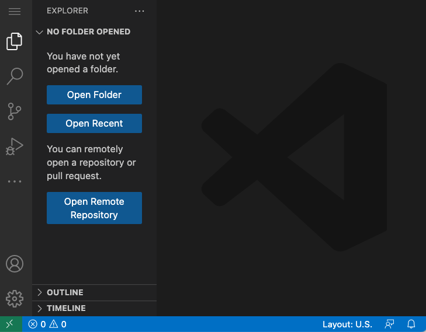

# Using a code editor

This lesson covers the basics of using [VSCode.dev](https://vscode.dev) a code editor for the web so that you can make changes to your code and contribute to a project without installing anything in your computer.

<!----
TODO: add an optional image

> Sketchnote by [Author name](https://example.com)
---->

<!---
## Pre-Lecture Quiz
[Pre-lecture quiz](https://ashy-river-0debb7803.1.azurestaticapps.net/quiz/3)
---->

## Learning objectives

In this lesson, you'll learn how to:

- Use a code editor in a code project
- Keep track of changes with version control
- Customize the editor for development

### Prerequisites

Before you begin, you'll need to create an account with [GitHub](https://github.com). Navigate to [GtiHub](https://github.com/) and create an account if you haven't already.

### Introduction

A code editor is an essential tool for writing programs and collaborating with existing coding projects. Once you understand the basics of an editor and how to make use of its features, you'll be able to apply them when writing code.

## Getting started with VSCode.dev

[VSCode.dev](https://vscode.dev) is a code editor on the web. You don't need to install anything in order to use it, just like opening any other website. To get started with the editor, open the following link: [https://vscode.dev](https://vscode.dev). If you aren't signed in into [GtiHub](https://github.com/), follow the prompts to sign in or create a new account and then sign in.

Once it loads, it should look similar to this image:



There are three main sections, starting from the far left and moving to the right:

1. The _activity bar_ which includes some icons, like the magnifying glass 🔎, the gear ⚙️  and a few others
1. The expanded acivity bar which defaults to the _Explorer_, called the _side bar_.
1. And finally, the code area to the right.

Click on each of the icons to display a different menu. Once done, click on the _Explorer_ so you are back where you started.

When you start creating code or modifying existing code, it will happen in the biggest area to the right. You'll use this area to visualize existing code as well, which you'll do next.


## Open a GitHub repository

The first thing you'll need is to open a GitHub repository. There are multiple ways of opening a repository. In this section you'll see two different ways you can open a repository so that you can start working on changes.

### 1. With the editor

Use the editor itself to open a remote repository. If you go to [VSCode.dev](https://vscode.dev) you will see an _"Open Remote Repository"_ button:


You can also use the command palette. The command palette is an input box where you can type any word that is part of a command or an action to find the right command to execute. Use the menu to the top-left, then select _View_, and then pick _Command Palette_, or using the following keyboard shortcut: Ctrl-Shift-P (on MacOS it would be Command-Shift-P).


Once the menu opens, type _open remote repository_, and then select the first option. Multiple repositories that you are part of or that you've opened recently will show up. You can also use a full GitHub URL to select one. Use the following URL and paste into the box:

```
https://github.com/microsoft/Web-Dev-For-Beginners
```

✅ If succesful, you'll see all files for this repository loaded in the text editor.


### 2. Using the URL

You can also use a url directly to load a repository. For example, the full URL for the current repo is [https://github.com/microsoft/Web-Dev-For-Beginners](https://github.com/microsoft/Web-Dev-For-Beginners), but you can swap the GitHub domain with `VSCode.dev/github` and load the repository directly. The resulting URL would be [https://vscode.dev/github/microsoft/Web-Dev-For-Beginners](https://vscode.dev/github/microsoft/Web-Dev-For-Beginners).

Open a repository on github.com and hit the . button on your keyboard to swap the github.com domain with the vscode.dev domain instantly.

✅ If succesful, you'll see all files for this repository loaded in the text editor.

## Edit files

## Using extensions


## Editing and updating


---

## 🚀 Challenge

Open a remote repository you have permissions to make changes and update some files. Next, try creating a new branch with your changes and make a Pull Request.

<!----
## Post-Lecture Quiz
[Post-lecture quiz](https://ashy-river-0debb7803.1.azurestaticapps.net/quiz/4)
---->

## Review & Self Study

Read more about [VSCode.dev](https://code.visualstudio.com/docs/editor/vscode-web?WT.mc_id=academic-0000-alfredodeza) and some of its other features.
