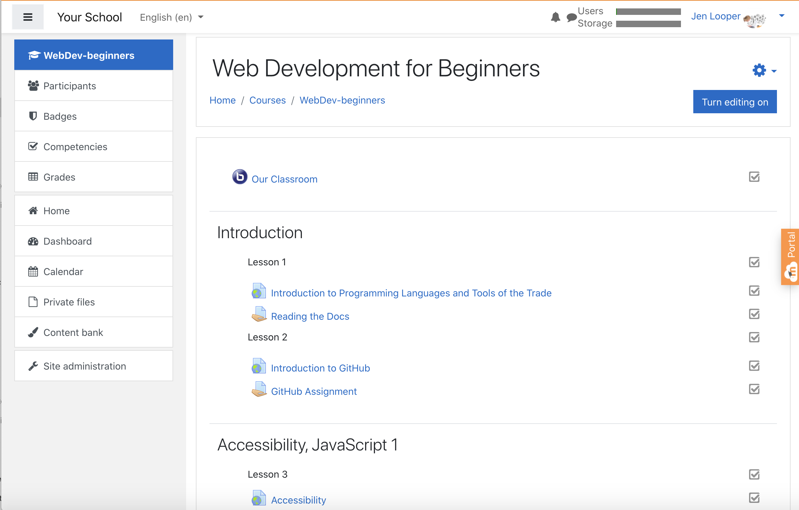
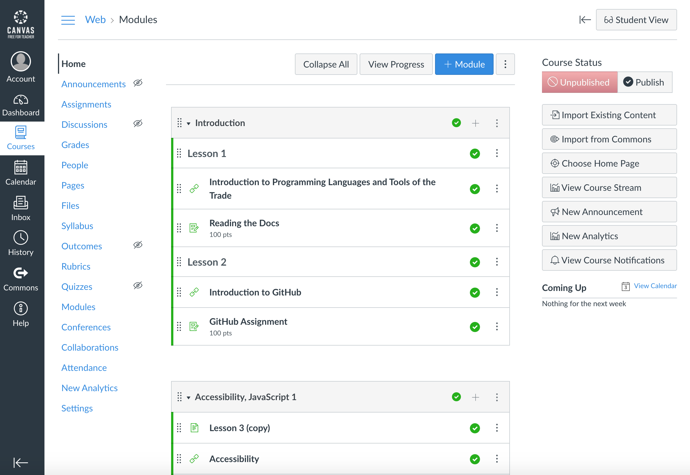

## Pour les éducateurs

Souhaitez-vous utiliser ce programme dans votre classe? N'hésitez pas!

En fait, vous pouvez l'utiliser dans GitHub lui-même en utilisant GitHub Classroom.

Pour ce faire, forkez ce repo. Vous allez devoir créer un référentiel pour chaque leçon, vous devrez donc extraire chaque dossier dans un référentiel distinct. De cette façon, [GitHub Classroom](https://classroom.github.com/classrooms) peut prendre chaque leçon séparément. 

Ces [instructions complètes](https://github.blog/2020-03-18-set-up-your-digital-classroom-with-github-classroom/) vous donneront une idée de la configuration de votre classe.

## Utilisation dans Moodle, Canvas ou Blackboard

Ce programme fonctionne bien dans ces systèmes de gestion de l'apprentissage ! Utilisez le [fichier de téléchargement Moodle](../teaching-files/webdev-moodle.mbz) pour le contenu complet, ou essayez le [fichier Common Cartridge](../teaching-files/webdev-common-cartridge.imscc) qui contient une partie du contenu. Moodle Cloud ne prend pas en charge les exportations Common Cartridge complètes, il est donc préférable d'utiliser le fichier de téléchargement Moodle qui peut être téléchargé dans Canvas. S'il vous plaît laissez-nous savoir comment nous pouvons améliorer cette expérience.

> Le programme dans une classe Moodle

> Le programme dans Canvas

## Utiliser le repo tel quel

Si vous souhaitez utiliser ce dépôt tel qu'il est actuellement, sans utiliser GitHub Classroom, cela peut également être fait. Vous auriez besoin de communiquer avec vos élèves sur quelle leçon travailler ensemble.

Dans un format en ligne (Zoom, Teams ou autre), vous pouvez créer des ateliers pour les quiz et encadrer les étudiants pour les aider à se préparer à apprendre. Invitez ensuite les élèves à participer aux quiz et soumettez leurs réponses sous forme de "problèmes" à un moment donné. Vous pouvez faire de même avec les devoirs, si vous voulez que les étudiants travaillent en collaboration en plein air.

Si vous préférez un format plus privé, demandez à vos élèves de convertir le programme, cours par cours, vers leurs propres dépôts GitHub en tant que dépôts privés, et vous donner accès. Ensuite, ils peuvent remplir des quiz et des devoirs en privé et vous les soumettre via des problèmes sur votre référentiel de classe.

Il existe de nombreuses façons de faire fonctionner cela dans un format de classe en ligne. Veuillez nous indiquer ce qui fonctionne le mieux pour vous!

## Veuillez nous donner votre avis!

Nous voulons que ce programme fonctionne pour vous et vos étudiants. Veuillez nous donner vos [feedbacks](https://github.com/microsoft/Web-Dev-For-Beginners/discussions/categories/teacher-corner).
